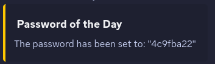

# MinecraftStatusHook

A Minecraft server plugin (1.20.4) that sends server updates to a Discord webhook, and enforces a simple player whitelist based on a password and IP addresses.

## Commands

- `/setdiscordwebhook <webhook-url>`: Sets the Discord webhook that MinecraftStatusHook will send updates to.
- `/potd`: Refreshes the password of the day, and sends it to the Discord webhook.

## Features

### Server Updates

The following events are sent to the Discord webhook:

- Server start

- Server stop

- Player join

- Player leave

- Refreshed password of the day

### Password of the Day

The password of the day is a simple way to whitelist players.

- The password is refreshed every 24 hours, or on server start, and is sent to the Discord webhook.
- Until the correct password is entered, players won't be able to move or interact with the server.
- Players are kicked on incorrect passwords.
- The password can be refreshed with `/potd`.
